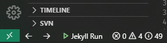
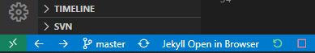
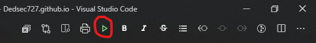
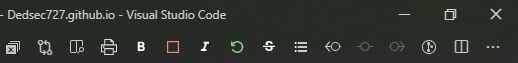

    
    
    
    
    

# VSCode Extension to Build & Run Jekyll Static Websites

This extension can simply Run your Jekyll site locally and opens your site in browser

## Features

If a Jekyll Workspace is open:

* You can run following commands from Command Palette/Keybindings:

  | Command | Shortcut | Functionality
  | --- | --- | --- |
  | Jekyll Run | (ctrl+F5) | Builds Project, Starts Jekyll Server & Opens the local hosted site in Browser
  | Jekyll Stop | (ctrl+F6) | Stops Jekyll Server
  | Jekyll Restart | (ctrl+F7) | Restarts Jekyll Server
  | Jekyll Build | (ctrl+F8) | Builds Project
  | Jekyll Open in Browser | (ctrl+F9) | Opens the local hosted site in Browser while Jekyll Server is running

* Status Bar shortcuts:

  * Jekyll Run

    

    
    

  * Jekyll Stop/Restart/Open in Browser

    

    
    

* Editor Title Menus:

  * Jekyll Run

    

    
    

  * Jekyll Stop/Restart

    

    
    

## Requirements

* Static Website Workspace in VSCode i.e, `_config.yml` should be present in the opened workspace
* [Jekyll](https://jekyllrb.com/docs/installation/)
